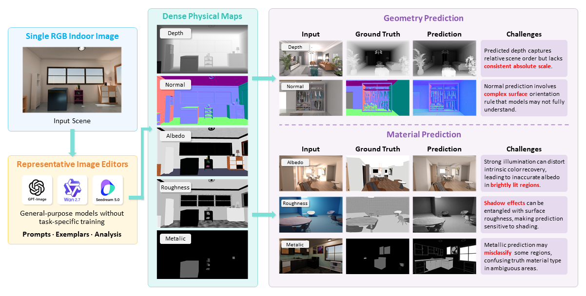

# Can Image Editors Predict Dense Physical Maps?

This repository provides benchmark-oriented code and release scaffolding for evaluating general-purpose image editors and related generative systems as single-image dense physical-map predictors without task-specific training. The focus is not a new task-specific model, but a reproducible evaluation protocol covering benchmark manifests, prompt and access-setting documentation, scene-audit scripts, metric computation utilities, and experiment organization.

<p align="center">
  
</p>

<p align="center">
  <em>Figure 1. Benchmark motivation and target scope: evaluating whether general-purpose image editors can recover dense geometry and material maps from a single RGB indoor image.</em>
</p>

## Overview

We study whether image editors can produce quantitatively reliable dense physical maps rather than merely plausible map-like images. The benchmark covers five indoor-scene targets:

- `depth`: relative scene-geometry recovery.
- `normal`: surface-orientation recovery.
- `albedo`: intrinsic reflectance-color recovery.
- `roughness`: bounded scalar material-roughness recovery.
- `metallic`: bounded continuous metallic-map recovery.

Results should be interpreted as **model--access-setting measurements**, not as interface-free rankings of intrinsic model capability.

## Repository Status

This repository is being organized as a benchmark release rather than a model-only code drop. It is intended to house:

- benchmark manifests and lightweight public examples;
- evaluation and aggregation utilities;
- prompt templates and scene-audit scripts;
- access-setting descriptors and protocol documentation;
- experiment configs for main, ablation, and comparison runs;
- reproducibility-oriented utilities and release notes.

Important scope notes:

- API keys and provider credentials for proprietary systems are not included.
- Redistribution of proprietary model outputs may depend on provider policy.
- Public results should be treated as versioned measurements under disclosed access settings, not as a permanent leaderboard.
- The repository currently includes release scaffolding, demo configs, and annotation/audit utilities; additional benchmark-specific manifests and documentation can be layered onto this structure.

## Benchmark Targets and Metrics

| Target | Official source(s) | Primary metric | Secondary diagnostics |
|---|---|---|---|
| Depth | OpenRooms-FF, InteriorVerse | AbsRel-AI | RMSE-AI, MAE-AI, delta1-AI, delta2-AI, Boundary F1 |
| Normal | OpenRooms-FF, InteriorVerse | Acc@22.5 | Mean angular, Median angular, Acc@11.25, Acc@30 |
| Albedo | OpenRooms-FF, InteriorVerse | MAE | PSNR, SSIM, LPIPS |
| Roughness | OpenRooms-FF | RMSE | MAE, SSIM, PSNR |
| Metallic | Companion metallic source | MAE | PSNR, SSIM, LPIPS |

`AI` denotes affine-invariant depth scoring after prediction normalization, polarity selection, and per-image affine fitting. Depth metrics therefore evaluate relative-geometry fidelity rather than calibrated metric-depth accuracy.

Metallic is evaluated as a continuous bounded map within `MetallicEvalMask`, not as a thresholded binary detection task. MAE is the primary scalar distortion metric, while PSNR, SSIM, and LPIPS are retained as full-map diagnostics. Because metallic regions are sparse, continuous full-map scores should be interpreted as masked metallic-value fidelity rather than explicit metallic-region detection accuracy.

## Source Design

The benchmark is target-dependent rather than source-uniform.

- `OpenRooms-FF` is used for depth, normal, albedo, and roughness.
- `InteriorVerse` is used for depth, normal, and albedo.
- InteriorVerse roughness and metallic are excluded from official scoring when material-channel reliability is not adequate.
- A companion metallic source is used for official metallic evaluation.

The companion metallic source is intended to provide auditable continuous metallic-map supervision under a bounded `[0,1]` material-parameter convention. It should not be interpreted as estimating the natural frequency of metallic materials in real indoor imagery, and official scores should not be read as thresholded metallic-region detection accuracy.

## Access Settings

We distinguish three protocol groups.

### Controlled Track

The system receives only:

- the query RGB image;
- a fixed target-definition instruction.

No paired exemplars, masks, region-filling priors, external references, per-image prompt selection, or cross-view input are used.

This track is the official main setting for:

- `depth`: controlled RGB-to-relative-depth prompting. Affine alignment and polarity selection are scoring-time operations, not model inputs.
- `roughness`: controlled RGB-to-map prompting.
- `metallic`: controlled RGB-to-map prompting.

### Target-Specific Elicitation Track

This track is used when a minimal RGB-to-map prompt does not reliably specify the target convention.

- `albedo` uses query-image-only auxiliary analysis plus a fixed illumination-suppression / structure-preservation instruction.
- `normal` uses fixed RGB-normal exemplar pairs to communicate the normal-map convention.

These results are reported as model--access-setting measurements, not as prompt-invariant or interface-free model capability estimates.

### Diagnostic Track

Diagnostic settings vary access assumptions, such as prompt weakening, exemplar removal, alternative exemplars, segmentation-assisted variants, or region-filling variants. Diagnostic results should not be mixed into the main official comparison.

## What This Repository Contains

The current tree already separates the benchmark workflow into a few clear layers:

- `annotation/`: public annotation schema, examples, validation, and scene-audit scripts.
- `docs/`: installation, dataset, annotation, and experiment notes.
- `experiments/`: target-wise main experiment scripts plus ablation and comparison experiment code.
- `src/`: shared Python package code for IO, dataset parsing, metrics, and runners.
- `tools/`: environment checks, demo data preparation, checkpoint conversion, and result summarization.
- `tests/`: lightweight validation for configs, dataset parsing, and adapters.

The current `annotation/scripts/` directory includes:

- `validate_annotations.py`: validates public annotation JSON files.
- `audit_scenes_doubao.py`: batch scene audit with Doubao.
- `audit_scenes_glm.py`: batch scene audit with GLM.
- `audit_scenes_qwen.py`: batch scene audit with Qwen plus lighting-stat support.
- `review_scene_audits_doubao.py`: final arbitration script for inconsistent merged scene audits.
- `scene_audit_prompts.py`: shared English prompt templates.
- `scene_audit_utils.py`: shared helpers for scene listing, image encoding, parsing, and lighting statistics.

## What This Repository Does Not Contain

To avoid confusion, this repository does not currently bundle:

- provider API credentials;
- full proprietary-system outputs when redistribution is restricted;
- large private datasets, checkpoints, or logs;
- a claim that one disclosed interface fully characterizes a model family;
- a claim that benchmark results are stable across future provider-side updates.

## Installation

Install the package in editable mode:

```bash
python -m pip install -e .
```

Then check the local environment:

```bash
python tools/check_env.py
```

## Quick Start

Validate the demo annotation:

```bash
python annotation/scripts/validate_annotations.py --input annotation/examples/demo_annotation.json
```

Materialize the demo manifest:

```bash
python tools/prepare_data.py
```

The `experiments/main/` directory contains the main experiment code for the official target-wise evaluation runs:

Browse the target-wise main experiment scripts:

```text
experiments/main/albedo/
experiments/main/depth/
experiments/main/metallic/
experiments/main/normal/
experiments/main/roughness/
```

## Data Preparation

The repository stores only lightweight public examples. Real datasets, checkpoints, logs, and large outputs should remain outside version control.

- Put actual images and annotations under `data/` following `docs/dataset.md`.
- Keep only tiny public examples in `data/samples/` and `annotation/examples/`.
- Use `tools/prepare_data.py` to materialize demo manifests and verify split files.

Before public benchmark release, it is natural to extend this structure with explicit benchmark manifests, access-setting descriptors, stress metadata, and source-balanced aggregation utilities.

## Reproducibility and Evaluation Scope

This repository is designed so that a benchmark release can expose:

- manifests describing evaluated samples and splits;
- target-specific prompt templates and access-setting descriptors;
- evaluation scripts with fixed metrics and masking behavior;
- stress-subset metadata and aggregation utilities;
- versioned experiment configs for main, ablation, and comparison tracks.
- for proprietary outputs that cannot be redistributed, prompts, output manifests, version records, request dates, file hashes, output-shape metadata, evaluator logs, failure logs, and post-processing records so that reported scores can be audited against frozen generation manifests.

At the same time, reproducibility claims should remain scoped:

- measurements are conditioned on disclosed access settings;
- proprietary systems may drift over time;
- some targets may require target-specific elicitation rather than a bare RGB-to-map prompt;
- synthetic-source evaluation does not imply direct transfer to real indoor imagery.

## Repository Layout

- `annotation/`: annotation contract, examples, and audit workflow.
- `data/`: lightweight sample inputs and dataset placement conventions.
- `docs/`: installation, dataset, annotation, and experiment documentation.
- `experiments/main/`: target-wise main experiment scripts for albedo, depth, metallic, normal, and roughness.
- `experiments/ablation/`: ablation experiment scaffold.
- `experiments/comparison/`: comparison experiment scaffold and baseline adapters.
- `src/`: shared package code.
- `tools/`: utility scripts for data prep, environment checks, summarization, and conversion.
- `tests/`: lightweight checks.

## Documentation

- Installation: [docs/install.md](/abs/path/C:/Users/CodexSandboxOffline/.codex/.sandbox/cwd/7075373748567092/docs/install.md)
- Dataset: [docs/dataset.md](/abs/path/C:/Users/CodexSandboxOffline/.codex/.sandbox/cwd/7075373748567092/docs/dataset.md)
- Annotation: [docs/annotation.md](/abs/path/C:/Users/CodexSandboxOffline/.codex/.sandbox/cwd/7075373748567092/docs/annotation.md)
- Main experiments: [docs/main_experiments.md](/abs/path/C:/Users/CodexSandboxOffline/.codex/.sandbox/cwd/7075373748567092/docs/main_experiments.md)
- Ablations: [docs/ablations.md](/abs/path/C:/Users/CodexSandboxOffline/.codex/.sandbox/cwd/7075373748567092/docs/ablations.md)
- Comparisons: [docs/comparisons.md](/abs/path/C:/Users/CodexSandboxOffline/.codex/.sandbox/cwd/7075373748567092/docs/comparisons.md)

Detailed benchmark-specific documentation can be split further before public release, for example into dedicated notes for access settings, metrics, stress subsets, companion metallic data, model versioning, and reproducibility checklists.

## Citation

If you use this repository or its benchmark protocol, please cite the corresponding paper release.

## License

This repository currently uses the MIT License. Please also check the licenses and redistribution policies of original source datasets and model providers before redistributing data or generated outputs.
