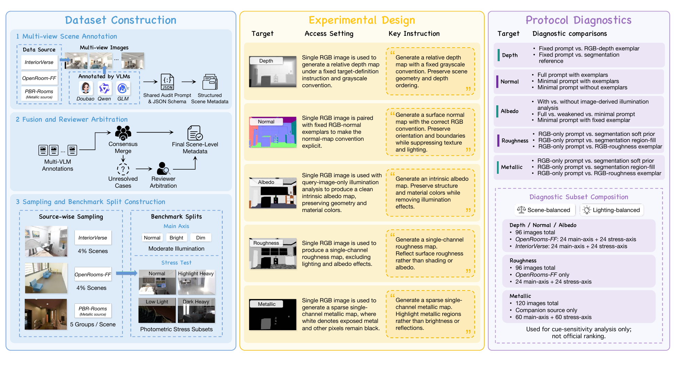
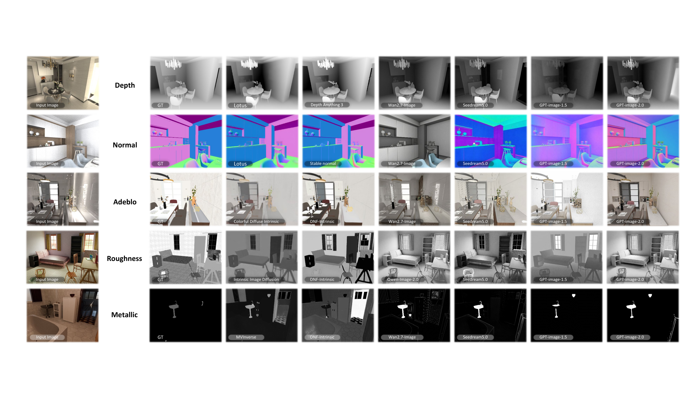

# Annotation Module

This directory isolates the public annotation contract from model training code.

## Overview

  <em>Project overview. Click the preview to open the full PDF.</em>

  <em>Generated results preview. Click the preview to open the full PDF.</em>

## Public Surface

- Schema: `annotation/schemas/annotation_schema.json`
- Example: `annotation/examples/demo_annotation.json`
- Validation: `annotation/scripts/validate_annotations.py`
- Scene audit tools:
  - `annotation/scripts/audit_scenes_doubao.py`
  - `annotation/scripts/review_scene_audits_doubao.py`
  - `annotation/scripts/audit_scenes_glm.py`
  - `annotation/scripts/audit_scenes_qwen.py`
  - `annotation/scripts/scene_audit_prompts.py`
  - `annotation/scripts/scene_audit_utils.py`

## Script Overview

- `validate_annotations.py`: validate public annotation JSON files before release or conversion.
- `audit_scenes_doubao.py`: batch scene audit with Doubao.
- `review_scene_audits_doubao.py`: final review for scenes whose three audit results remain inconsistent after merge; the merged result uses majority voting as supporting context, and the script asks Doubao to make the final arbitration from the images plus merged evidence.
- `audit_scenes_glm.py`: batch scene audit with GLM.
- `audit_scenes_qwen.py`: batch scene audit with Qwen plus lighting-stat based field completion.
- `scene_audit_prompts.py`: shared English prompt templates for the audit scripts.
- `scene_audit_utils.py`: shared scene listing, image encoding, JSON extraction, and lighting-stat helpers.

These scripts are kept directly under `annotation/scripts/` so the annotation workflow is visible in one place.
